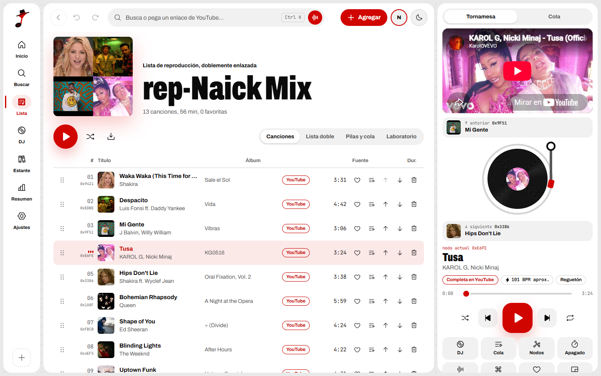
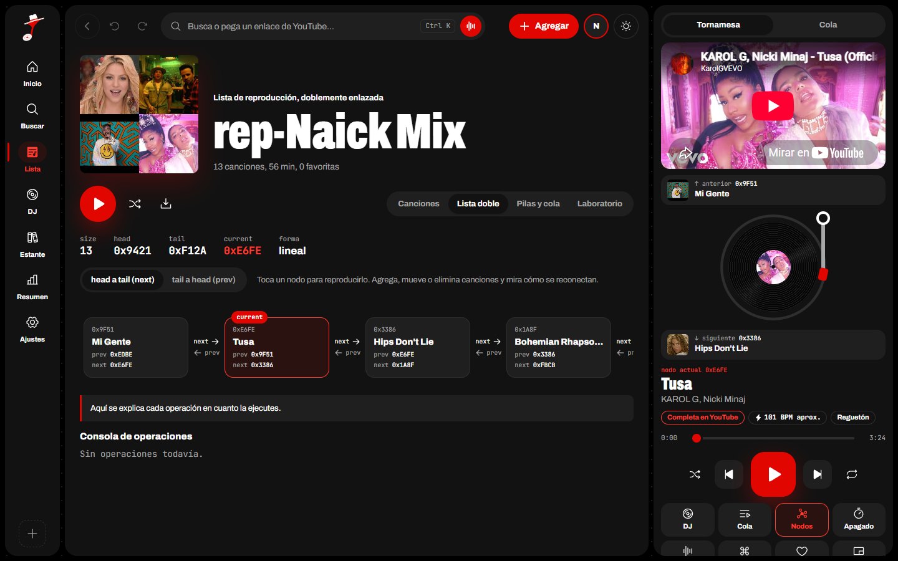
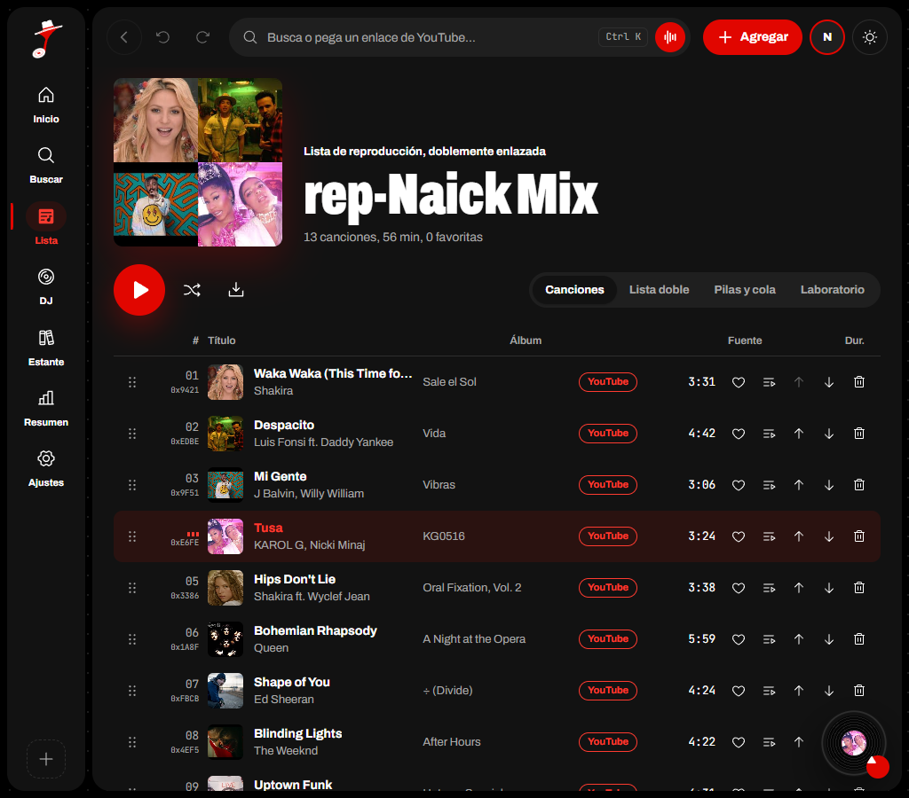
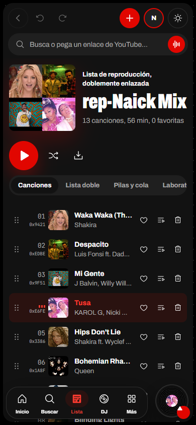

# rep-Naick

Reproductor de música web cuya lista de reproducción es una **lista doblemente enlazada implementada a mano** en TypeScript. Taller de la materia *Estructuras de Datos*.

**Demo en vivo: https://repo-naick.vercel.app**

Las canciones suenan completas con el reproductor oficial de YouTube incrustado. La interfaz muestra por dentro la estructura: nodos, punteros `prev` y `next`, `head`, `tail` y `current`.



| Lista doble en vivo | Tablet | Celular |
| --- | --- | --- |
|  |  |  |

## Qué es una lista doblemente enlazada

Es una estructura formada por **nodos**. Cada nodo guarda un valor (aquí, una canción) y **dos punteros**: uno al nodo anterior (`prev`) y otro al siguiente (`next`). La lista solo recuerda dónde empieza (`head`), dónde termina (`tail`) y, en este reproductor, qué canción suena (`current`).

```
          head                    current                   tail
           │                         │                        │
           ▼                         ▼                        ▼
        ┌──────┐   next   ┌──────┐   next   ┌──────┐   next   ┌──────┐
null ◄──│  A   │ ───────► │  B   │ ───────► │  C   │ ───────► │  D   │──► null
        │      │ ◄─────── │      │ ◄─────── │      │ ◄─────── │      │
        └──────┘   prev   └──────┘   prev   └──────┘   prev   └──────┘
```

Frente a un arreglo y a una lista simple, aporta tres cosas que un reproductor necesita:

- **Retroceder cuesta lo mismo que avanzar.** "Canción anterior" es `current = current.prev`. En una lista simple habría que recorrer desde el inicio.
- **Insertar o eliminar no mueve a los demás.** Solo se reconectan los punteros de los vecinos: 4 al insertar en el medio, 2 al eliminar.
- **Se puede llegar a una posición desde el extremo más cercano.** Si está en la segunda mitad, se camina desde `tail` hacia atrás, así que nunca se dan más de n/2 pasos.

### Insertar en el medio: 4 punteros

```
antes:     [A] ⇄ [C]                 insertAt(1, B)

1. B.prev = A        2. B.next = C        3. A.next = B        4. C.prev = B

después:   [A] ⇄ [B] ⇄ [C]
```

### Eliminar: 2 punteros

```
antes:     [A] ⇄ [B] ⇄ [C]           removeAt(1)

1. A.next = C        2. C.prev = A

después:   [A] ⇄ [C]                 (B queda suelto, con prev = next = null)
```

Si el nodo eliminado era la canción que sonaba, `current` pasa al siguiente; si era el último, al anterior; y si no queda ninguno, a `null`.

## Complejidad (Big-O)

La implementación está en [src/lib/DoublyLinkedList.ts](src/lib/DoublyLinkedList.ts).

| Operación | Método | Complejidad | Por qué |
| --- | --- | --- | --- |
| Agregar al inicio | `addFirst` | O(1) | Solo se toca `head`. |
| Agregar al final | `addLast` | O(1) | El puntero `tail` evita recorrer la lista. |
| Insertar en una posición | `insertAt` | O(n) | Hay que caminar hasta la posición (máximo n/2 pasos); enlazar es O(1). |
| Insertar después de la actual | `insertAfterCurrent` | O(1) | El nodo `current` ya se conoce. |
| Eliminar por posición | `removeAt` | O(n) | Caminar hasta el nodo (máximo n/2 pasos); desenlazar es O(1). |
| Eliminar por identificador | `removeById` | O(n) | Búsqueda lineal desde `head`. |
| Canción siguiente | `next` | O(1) | `current = current.next`. |
| Canción anterior | `previous` | O(1) | `current = current.prev`. |
| Subir o bajar una posición | `moveUp`, `moveDown` | O(n) | Caminar hasta el nodo; el intercambio con el vecino es O(1). |
| Mover a otra posición | `moveTo` | O(n) | Se desenlaza y se vuelve a enlazar el mismo nodo. |
| Leer una posición | `getAt` | O(n) | No hay acceso directo como en un arreglo. |
| Buscar la posición de un id | `indexOf` | O(n) | Búsqueda lineal. |
| Vaciar | `clear` | O(n) | Limpia los punteros de cada nodo. |
| ¿Está vacía? | `isEmpty` | O(1) | Compara `size` con 0. |
| Copiar a un arreglo | `toArray` | O(n) | Solo para pintar la interfaz. |
| Ordenar | `sort` | O(n²) | Ordenamiento por inserción que reenlaza nodos. |

**Espacio:** O(n), con dos punteros extra por nodo.

### Regla del taller: sin arreglos

Dentro de `DoublyLinkedList` no hay ningún arreglo: los nodos se guardan y se mueven solo con punteros. `toArray()` existe para dos cosas que no se pueden hacer de otra forma:

1. **Pintar la interfaz** (React necesita algo que recorrer).
2. **Guardar en `localStorage`** (JSON no puede serializar punteros). Al cargar, la lista se reconstruye nodo por nodo con `addLast`.

Las estructuras auxiliares también están hechas con la lista doble:

- [Stack.ts](src/lib/Stack.ts) (pila LIFO): deshacer, rehacer, historial de lo escuchado y el botón "atrás".
- [Queue.ts](src/lib/Queue.ts) (cola FIFO): "Reproducir a continuación", la consola de operaciones y los avisos.

Deshacer no guarda copias de la lista: cada operación apila **su inversa** (agregar ⇄ eliminar, mover de A a B ⇄ mover de B a A).

## Funcionalidades

- **Agregar** una canción al inicio, al final o en una posición validada. Antes de confirmar se muestra la operación exacta, por ejemplo `insertAt(6)  5 pasos desde tail  O(n)`.
- **Eliminar** con confirmación sutil (dos toques) y opción de deshacer.
- **Adelantar y retroceder** siguiendo `next` y `prev`.
- **Reproducción real** con YouTube: play y pausa, barra de progreso, salto de tiempo y paso automático a la siguiente. Las canciones agregadas sin video usan un temporizador simulado.
- **Reordenar** con botones y arrastrando, **repetir** (apagado, toda la lista, una), **aleatorio**, **buscar**, **favoritas**, **duración total**, **deshacer y rehacer**, **volumen**, cola "a continuación" y **restaurar** las canciones iniciales.
- **Visualizador de la estructura**: nodos con flechas `prev ⇄ next`, marcas de `head`, `tail` y `current`, recorrido en ambos sentidos y animación al insertar, eliminar o mover. Incluye una consola con cada operación y su costo.
- **Extras**: Modo DJ (ordena por ritmo o género moviendo nodos), estante con colecciones automáticas, resumen de lo escuchado, comandos de texto y voz (`Ctrl K`), temporizador de apagado, mini reproductor, laboratorio de rendimiento, exportar e importar en JSON, tema claro y oscuro.

### Atajos de teclado

| Tecla | Acción |
| --- | --- |
| `Espacio` | Reproducir o pausar |
| `→` y `←` | Canción siguiente y anterior |
| `Ctrl K` | Comandos |
| `Ctrl Z` y `Ctrl Y` | Deshacer y rehacer |
| `L` | Favorita |
| `M` | Silenciar |
| `/` | Ir al buscador |

## Arquitectura

```
api/                    Backend: funciones de Vercel
  _youtube.ts           Lógica: habla con la YouTube Data API v3
  search.ts             GET /api/search?q=   busca canciones
  info.ts               GET /api/info?id=    datos de un video
  health.ts             GET /api/health      estado del servidor
src/
  lib/                  Núcleo sin dependencias
    DoublyLinkedList.ts La lista doble
    Stack.ts, Queue.ts  Pila y cola sobre la lista doble
    commands.ts         Intérprete de comandos en español
    format.ts           Tiempo, texto y enlaces
    __tests__/          Pruebas de Vitest
  player/               Estado del reproductor
    store.ts            Lista, cola, historial, deshacer y persistencia
    engine.ts           Motor de YouTube y motor simulado
    seed.ts             Canciones iniciales
  components/           Tornamesa, tabla, visualizador de nodos, diálogos
  views/                Acceso, lista, inicio, buscar, DJ, estante, resumen, ajustes
  styles/               Tokens de diseño y estilos
```

- **Frontend:** Vite + React + TypeScript en modo estricto. El estado se guarda en `localStorage`.
- **Backend:** tres funciones de Vercel. Existen para que la **clave de YouTube nunca llegue al navegador**: el navegador llama a `/api/search` y la función usa la variable de entorno `YOUTUBE_API_KEY`.
- **Audio:** se usa solo el reproductor oficial de YouTube, con el video visible, como piden sus condiciones de uso. La app no descarga ni extrae audio.

## Cómo ejecutar

Requisitos: Node.js 20 o superior.

```bash
npm install
```

```bash
npm run dev
```

En local se abre en `http://localhost:5173`. La versión publicada está en https://repo-naick.vercel.app.

### Clave de YouTube (opcional pero recomendada)

Sin clave, la app funciona y permite agregar canciones **pegando el enlace** del video. Con clave, además permite **buscar por nombre**.

1. Entra a [Google Cloud Console](https://console.cloud.google.com) y crea un proyecto.
2. *APIs y servicios → Biblioteca* → **YouTube Data API v3** → *Habilitar*.
3. *APIs y servicios → Credenciales → Crear credenciales → Clave de API*.
4. En la clave: *Restricciones de API → Restringir clave → YouTube Data API v3*.
5. Copia `.env.example` como `.env.local` y pega la clave:

```
YOUTUBE_API_KEY=tu_clave
```

`.env.local` está en `.gitignore`: nunca se sube. La cuota gratuita es de 10.000 unidades al día y cada búsqueda cuesta unas 101, así que alcanza para cerca de 99 búsquedas diarias. Pegar enlaces casi no gasta cuota.

## Cómo probar

```bash
npm test
```

Corre 118 pruebas con Vitest:

| Archivo | Qué cubre |
| --- | --- |
| `DoublyLinkedList.test.ts` | Lista vacía, un elemento, índices inválidos, insertar y eliminar al inicio, medio y final, eliminar la canción actual, `next` y `previous` en los extremos según el modo repetir, mover, ordenar y 10.000 nodos. |
| `StackQueue.test.ts` | Pila LIFO y cola FIFO, con y sin límite. |
| `store.test.ts` | Agregar con validación, eliminar, reproducir, aleatorio, cola, deshacer, temporizador, errores del video y persistencia. |
| `commands.test.ts` | Intérprete de comandos. |
| `format.test.ts` | Tiempo, texto y enlaces de YouTube. |

Revisión de tipos y build de producción:

```bash
npm run build
```

La salida queda en `dist/`.

## Cómo desplegar en Vercel

```bash
npx vercel login
```

```bash
npx vercel --prod
```

Vercel detecta Vite, publica `dist/` como sitio estático y convierte `api/` en funciones. Para activar la búsqueda por nombre, agrega la clave en *Project → Settings → Environment Variables* con el nombre `YOUTUBE_API_KEY` y vuelve a desplegar.

## Decisiones y límites

- **Perfil local.** La pantalla de acceso solo pide un nombre y lo guarda en el navegador. No hay cuentas ni contraseñas.
- **Sin funciones sociales.** Las referencias de diseño muestran sala compartida, bandeja y lista colaborativa; necesitan cuentas y tiempo real, así que no están.
- **Algunos videos no se pueden insertar.** Si el dueño lo bloquea, la app avisa y salta al siguiente.
- **Las direcciones `0x…` son decorativas.** JavaScript no expone direcciones de memoria; se calculan con un hash del id para que cada nodo tenga siempre la misma.
- **Duración y BPM iniciales aproximados.** La duración se corrige sola con la real cuando el video carga.
